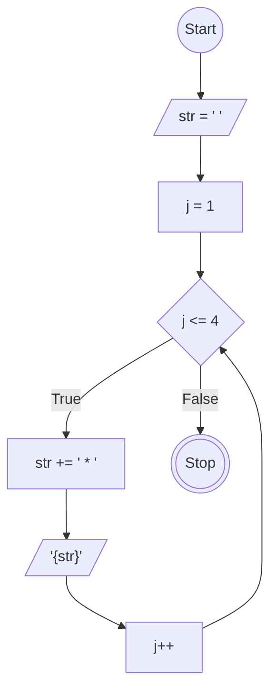
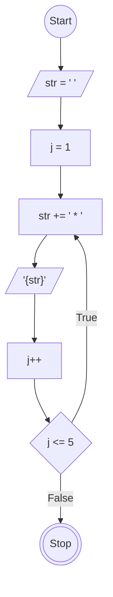

# Javascript Loop While and Do-while

## Flowchart Loop While
Membuat Flowchart untuk program Perulangan While yang menghasilkan pattern segitiga

## Flowchart Do-While

Membuat Flowchart untuk program Perulangan Do-While yang menghasilkan pattern segitiga

