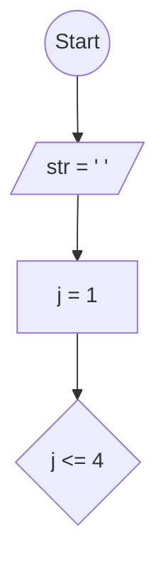

# Javascript Loop While and Do-while

## Flowchart Loop While
Membuat Flowchart untuk program Perulangan While yang menghasilkan pattern segitiga

```mermaid

   flowchart TD
   a@{ shape: circle, label: "Start" }
   b@{ shape: lean-r, label: " str = ' '" }
   c@{ shape: rect, label: " j = 1 " }
   d@{ shape: diamond, label: " j <= 4" }


    a --> b --> c --> d

```
